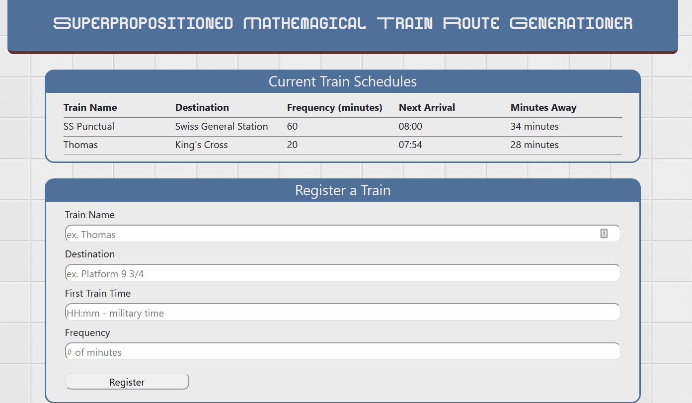
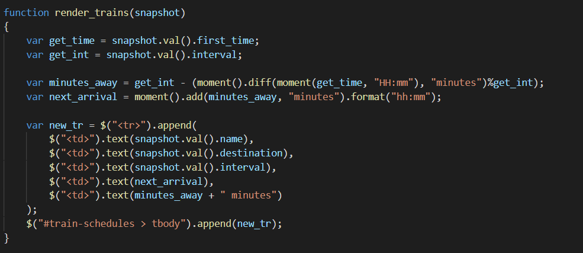

# train_schedules
The schedules of the trains

You are a conductor! Manage and name your trains well!. I say you are because I never got around to adding the distinction between those who can add trains and those who can't.

Most of the code was pretty old hat but this little bundle of frustration was very new, and pretty much does everything and I haven't a clue why.

Don't ask me how it just does.

There's no Gif because it would literally be staring at a thing for a few minutes while it slowly ticks over.
